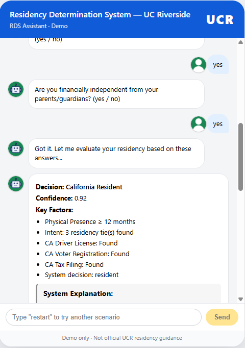
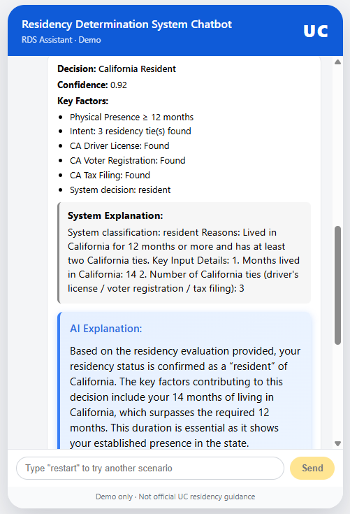
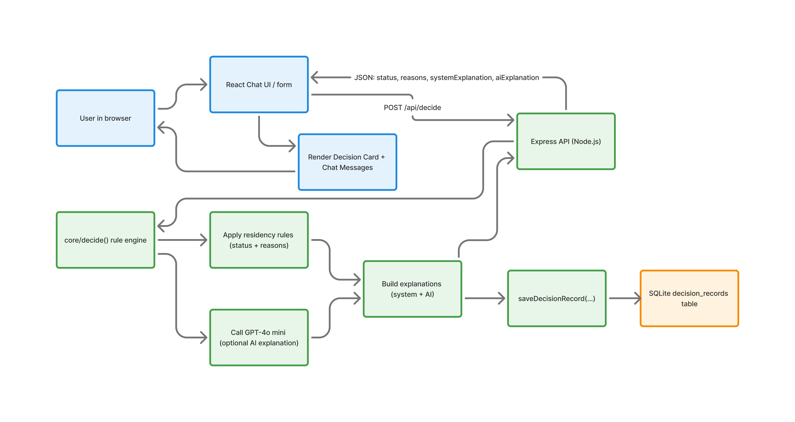
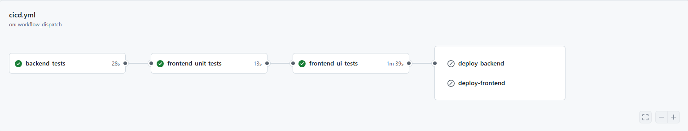

# Residency Determination Mini System (RDS Assistant)

An interactive **Residency Determination chatbot** for University of California, built with a modern **full‑stack TypeScript** architecture.  This project simulates a realistic workflow used in Student Information Systems, combining automated residency logic, AI‑generated explanations, SQLite data persistence, and a production‑grade CI/CD pipeline.

## 🌟 Demo Preview

[Chatbot Interaction **Live Demo**](https://residence-determination-mini-sy-git-c10d0f-chaoran-lus-projects.vercel.app/)

---
<div align="center">
  <table>
    <tr>
      <td align="center">
        
        <br/>
        <sub><i>Chatbot conversation flow</i></sub>
      </td>
      <td align="center">
        
        <br/>
        <sub><i>Decision summary & explanations</i></sub>
      </td>
    </tr>
  </table>
</div>

## 🔄 Runtime Workflow (End-to-End)

<div align="center">
  
  <br/>
  <sub><i>React chat UI sends a decision request to the Express API, the core rule engine and GPT-4o mini generate explanations, results are saved to SQLite, and a JSON decision response updates the chat UI.</i></sub>
</div>

## 📁 Directory Structure
```
.
├── .github/workflows
│ └── cicd.yml # GitHub Push/PR → CI Tests → (main only) → Deploy Backend → Deploy Frontend
| 
├── backend/
│   ├── src/
│   │   ├── ai.ts               # GPT‑4o‑mini integration
│   │   ├── core/               # Residency logic, Zod schemas
│   │   ├── routes/             # Express routes
│   │   ├── services/           # Reusible app business logic and operations
│   │   ├── persistence.ts      # Persistence module encapsulates database CRUD Operations
│   │   ├── db.ts               # SQLite setup + migrations
│   │   └── index.ts            # Express server entry
│   └── tests/                  # Jest + Supertest
│
├── frontend/
│   ├── src/
│   │   ├── components/         # Chat UI components
│   │   ├── utils/              # Pure, side-effect-free helper functions used across the project
│   │   ├── api/                # Defined all backend communication logic
│   │   ├── hooks/              # useChatStateMachine
│   │   ├── constants/          # Endpoints + config
│   │   ├── types/              # Shared TS types
│   │   └── App.tsx
│   └── tests/                  # Vitest + Playwright
│
└── README.md
```

## 🔧 Tech Stack

### Frontend – React + Vite (Vercel)
- Custom chatbot UI  
- State machine handled by `useChatStateMachine` hook  
- DecisionCard renders system + AI interpretations  
- Environment variables:
  - `VITE_API_BASE_URL` → backend URL

### Backend – Node.js + Express (Render)
- Routes:
  - `POST /api/decision`
  - `GET /api/health`
- Modules:
  - `/core` — decision logic & explanation engine
  - `ai.ts` — calls GPT‑4o‑mini
  - `persistence.ts` — SQLite write layer
  - `db.ts` — DB bootstrap + migrations

### Database – SQLite
- Lightweight, perfect for demos + small datasets
- Decision history stored for audit + UI replay + future ML

### **CI/CD Pipeline**

<div align="center">
  
  <br/>
  <sub><i>Deployment architecture + CI/CD workflow</i></sub>
</div>

This project uses a full CI/CD pipeline built with **GitHub Actions**, ensuring code quality and reliable deployments.  
The pipeline runs automatically on every pull request and on every push to the `main` branch affecting either the frontend or the backend.

#### Continuous Integration (CI)

The pipeline performs three layers of automated testing:

1. **Backend Unit & API Tests**
   - Runs Jest-based unit tests and Supertest-based API tests.
   - Validates routing, payload validation, and decision logic.

2. **Frontend Unit Tests (Vitest)**
   - Executes component and utility tests inside a JSDOM environment.
   - Ensures UI logic and state machine behavior remain stable.

3. **Frontend UI Tests (Playwright)**
   - Spins up the backend locally.
   - Boots the Vite dev server.
   - Runs full browser-based E2E tests simulating user interaction with the chatbot.

All PRs must pass these tests before merging.

---

#### Continuous Deployment (CD)

When changes are pushed to `main` and **all tests pass**, the pipeline triggers automated deployments:

##### **Backend Deployment (Render)**
- Uses Render’s Deploy Hook to build and release a new version of the Node.js/Express API.
- Provides a stable long-running backend service for `/api/decision`, `/health`, and `/api/health`.

##### **Frontend Deployment (Vercel)**
- Uses the Vercel CLI to:
  1. Pull production environment variables
  2. Build the optimized React/Vite SPA
  3. Deploy it globally via Vercel’s CDN

This ensures the frontend always targets the correct backend via `VITE_API_BASE_URL`.

---

#### 🔗 This automated pipeline guarantees:

- Verified code before deployment  
- Zero manual steps  
- Fast and consistent releases  
- Clear separation between frontend and backend environments  

## 🚀 Deployment Architecture

This project follows a simple and reliable **frontend–backend separation** model optimized for modern web applications.

---

### Frontend (React + Vite) — Vercel

The user interface is built as a React SPA using Vite and deployed on **Vercel**.

**Why Vercel for the frontend?**

- Zero-config builds for React/Vite
- Global CDN for fast static asset delivery
- Automatic deployments from GitHub on every push (Preview Deployments)
- Environment variables support (e.g., `VITE_API_BASE_URL`) for targeting different backends

The frontend communicates with the backend exclusively via a JSON REST API.

---

### Backend (Node.js + Express) — Render

The residency decision engine is implemented as a standalone **Express** server and deployed as a **Render Web Service**.

**Why Render for the backend?**

- Designed for **long-running Node processes**
- Familiar server-style model (routing, middleware, logging)
- Health check endpoints:
  - `GET /health` – basic JSON health check
  - `GET /api/health` – API subsystem health check
- Clear separation between API logic and frontend build artifacts

Render builds and starts the backend from the `backend/` directory with:

```bash
npm install && npm run build
npm start
```

## ▶️ Running Locally

**Backend**

    cd backend
    npm install
    npm run dev

**Frontend**

    cd frontend
    npm install
    npm run dev

## 🧪 Testing Locally

### Backend Unit Tests

    npm run test:unit

### Backend API Tests

    npm run test:api

### Frontend Unit Tests

    npm run test:unit

### Playwright UI Tests

    npm run test:ui

## 👤 Author

Chaoran (Shaobangzhu)

Demo only --- not official residency determination.
