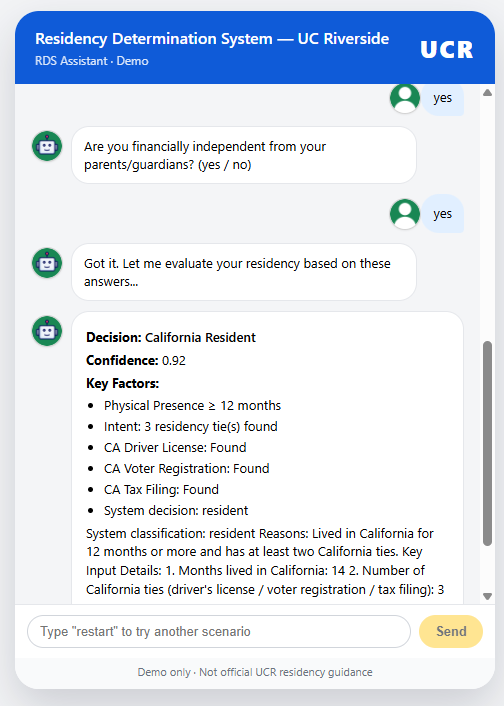

# Residency Determination Mini System (RDS Assistant)

An interactive **Residency Determination chatbot** for UC Riverside,
built with a modern **full-stack TypeScript** architecture.\
This project demonstrates a realistic academic workflow for evaluating
residency status using automated logic, clean UI design, and
production-style engineering patterns.

Designed as a portfolio-quality project with:

- **React + State Machine chatbot UI**
- **Express + Zod decision engine**
- **Vitest + React Testing Library unit tests**
- **Playwright end-to-end UI automation**
- **Full CI pipeline (GitHub Actions)**

## 🌟 Demo Preview

[Chatbot Interaction Live Demo](https://residence-determination-mini-sy-git-c10d0f-chaoran-lus-projects.vercel.app/)

---



## 🔧 Tech Stack

### **Frontend**

- React + TypeScript
- Vite
- State Machine (custom hook)
- React Testing Library (RTL)
- Vitest
- Playwright (UI automation)

### **Backend**

- Express.js (TypeScript)
- Zod validation
- Jest + Supertest

### **CI Pipeline**

- GitHub Actions (unit, API, UI tests)

## 📁 Directory Structure
```
.
├── .github/workflows
│ └── ci.yml # Whenever there were pull request from backend or frontend or push to main branch, trigger the tests
| 
├── backend/
│ ├── src/
│ │ ├── core/ # Decision logic, explanation engine
│ │ ├── routes/ # Express routes
│ │ └── index.ts # Express app entry
│ └── tests/ # Jest unit & API test suites
│
├── frontend/
│ ├── src/
│ │ ├── components/ # React UI components
│ │ ├── hooks/ # useChatStateMachine
│ │ ├── constants/ # Shared constants
│ │ └── App.tsx
│ └── tests/ # Vitest unit tests & # Playwright UI tests
│
├── .github/workflows/
│ └── ci.yml # Consolidated CI pipeline
│
└── README.md
```
## 🚀 Deployment Architecture

This project follows a simple and reliable **frontend–backend separation** model optimized for modern web applications.

---

### Frontend (React + Vite) — Vercel

The user interface is built as a React SPA using Vite and deployed on **Vercel**.

**Why Vercel for the frontend?**

- Zero-config builds for React/Vite
- Global CDN for fast static asset delivery
- Automatic deployments from GitHub on every push (Preview Deployments)
- Environment variables support (e.g., `VITE_API_BASE_URL`) for targeting different backends

The frontend communicates with the backend exclusively via a JSON REST API.

---

### Backend (Node.js + Express) — Render

The residency decision engine is implemented as a standalone **Express** server and deployed as a **Render Web Service**.

**Why Render for the backend?**

- Designed for **long-running Node processes**
- Familiar server-style model (routing, middleware, logging)
- Health check endpoints:
  - `GET /health` – basic JSON health check
  - `GET /api/health` – API subsystem health check
- Clear separation between API logic and frontend build artifacts

Render builds and starts the backend from the `backend/` directory with:

```bash
npm install && npm run build
npm start
```

## 🧪 Testing

### Backend

    npm run test

### Frontend Unit Tests

    npm run test:unit

### Playwright UI Tests

    npm run test:ui

## ▶️ Running Locally

**Backend**

    cd backend
    npm install
    npm run dev

**Frontend**

    cd frontend
    npm install
    npm run dev

## 👤 Author

Chaoran (Shaobangzhu)

Demo only --- not official residency determination.
